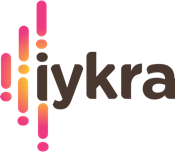

# IYKRA-Bootcamp
</br>
<p align="center"></p></br>
<p align="justify">Hello guys, I just want to share my knowledge that I got from IYKRA Data Science Bootcamp in this repository. This is very awesome journey I think, because this bootcamp teach me more about the data science start from basic to expert. It will also open your horizons that Data Science is not only about build model with machine learning, evaluate and get the high accuracy.You will also be introduced to other role like Data Analyst, Data Engineer, Machine Learning Engineer, Business Intelligence and of course Data Scientist. So I will continue to update this repository for the next 3 months, keep learning guys :)</br></br>
Want to know about iykra? <strong>jump to</strong> <a href="https://iykra.com/"> IYKRA website </a></p>

**Bootcamp subject:**
<ol>
  <li>Intro to Data Science</li>
  <li>Data Visualization</li>
  <li>Coding</li>
  <li>Statistic for Data Science</li>
  <li>Basic Data Analysis</li>
  <li>Machine Learning</li>
  <li>Business Legal</li>
  <li>Basic Big Data</li>
</ol>  

**Video Link and other**
  <ul>
    <li>My Tableu Link : <a href="https://public.tableau.com/profile/mohamad.irwan.afandi#!/?newProfile=&activeTab=0">Coffee shope and FIFA 19 Analysis</a></li>
  </ul>
  
#

```bash
This reposity status "ON PROGRESS", I will update it every week
August 12, 2020
```
